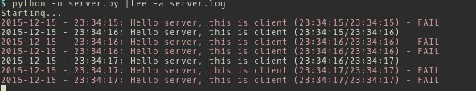

# wiretap-client-server-scripts
These Python scripts are used to establish an ongoing dummy communication between a server and a client. This can be used for wiretap excercises. 

**goal**

Try to sniff each directions of the communication off the wire by creating a physical wiretap, without interrupting the communication.

## Usage
Start the script `server.py` on your server machine and `client.py` on the client machine. Once connected, the scripts will exchange a simple hello message back and forth every second. The output will be red if the time difference between two messages is not 1 second. 

### Run with stdout only
Simply start the scripts.

    $ python server.py 
    Starting...
    2015-12-15 - 23:32:15: Hello server, this is client (23:32:14/23:32:15)
    2015-12-15 - 23:32:16: Hello server, this is client (23:32:15/23:32:16)
    2015-12-15 - 23:32:17: Hello server, this is client (23:32:16/23:32:17)
    
    
    $ python client.py
    Starting...
    2015-12-15 - 23:32:15: Hello client, this is server (23:32:14/23:32:15)
    2015-12-15 - 23:32:16: Hello client, this is server (23:32:15/23:32:16)
    2015-12-15 - 23:32:17: Hello client, this is server (23:32:16/23:32:17)

### Run with logging
To show stdout and log to a file at the same time, use the following commands.

    $ python -u server.py |tee -a server.log
    Starting...
    2015-12-15 - 23:33:31: Hello server, this is client (23:33:30/23:33:31)
    
    
    $ python -u client.py |tee -a client.log
    Starting...
    2015-12-15 - 23:33:31: Hello client, this is server (23:33:30/23:33:31)

### Error messages
This is what error messages look like this:

